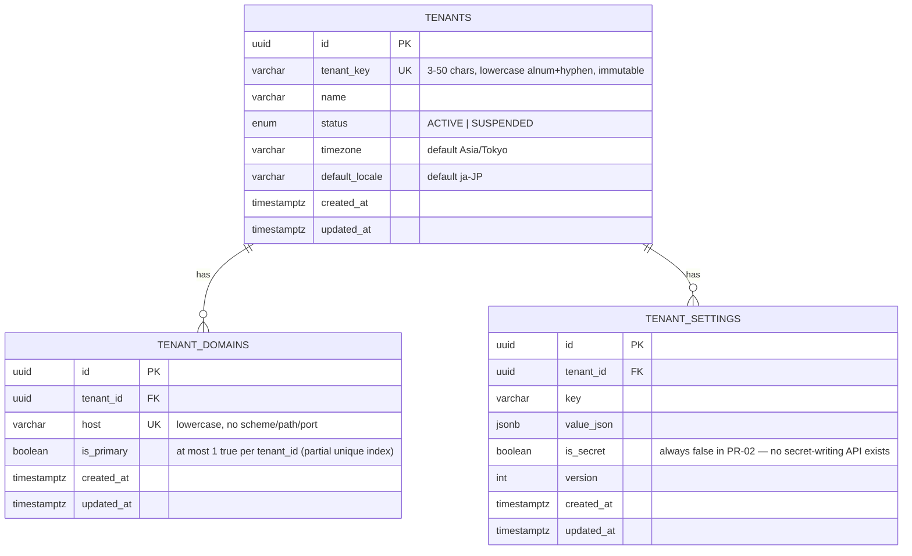

# ER Diagram — PR-02

Only the three tables PR-02 introduces. No Admin, User, LINE, booking, or
payment tables exist yet — see `docs/architecture/DATABASE_BOUNDARIES.md`
and `OPEN_QUESTIONS_PR02.md` for what's deferred.

## Constraints not visible in the diagram

- `tenant_domains_tenant_id_primary_key`: a **partial** unique index —
  `UNIQUE (tenant_id) WHERE is_primary = true` — added by raw SQL in the
  migration because Prisma's schema language can't express a partial
  unique index. See
  `prisma/migrations/20260727101006_pr02_tenant_foundation/migration.sql`.
- `tenant_settings`: `UNIQUE (tenant_id, key)`.
- Both `tenant_domains.tenant_id` and `tenant_settings.tenant_id` use
  `ON DELETE RESTRICT ON UPDATE RESTRICT` — a Tenant can't be deleted while
  child rows exist, and PR-02 exposes no delete path for Tenants at all.

## Field naming

- Database: `snake_case` (e.g. `tenant_key`, `default_locale`).
- Prisma schema / generated TypeScript: `camelCase` (e.g. `tenantKey`,
  `defaultLocale`), mapped via `@map`/`@@map`.
- All timestamps are `timestamptz`; all primary/foreign keys are
  PostgreSQL `uuid`.
